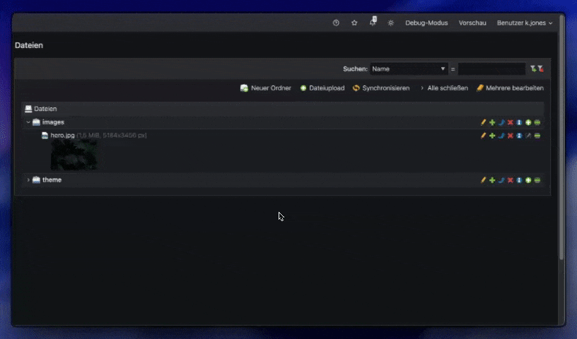
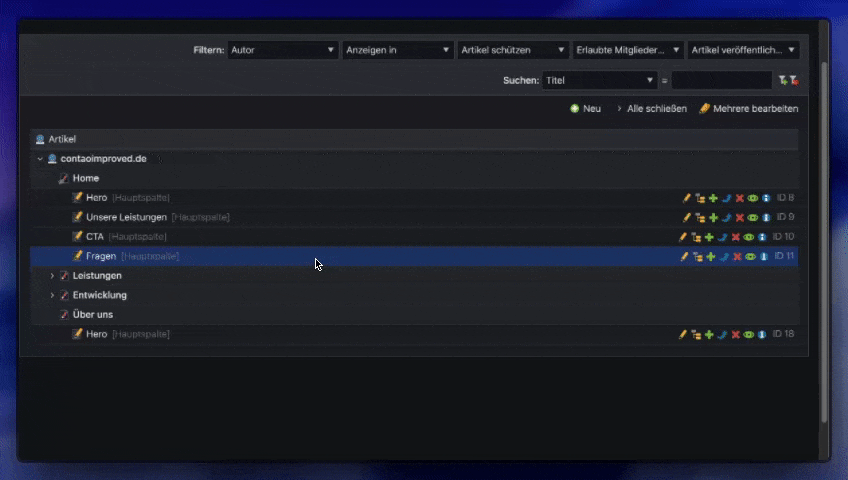

# Contao Improved

**Contao Improved** is a lightweight Chrome extension that enhances the Contao backend with several quality-of-life features for editors and developers.

---

## ✨ Features

- **Context Menu:**
  Quickly access actions by right-clicking on element entries.

- **Search Bar in Edit Multiple Screen:**
  Easily find and filter settings when editing multiple elements.

- **Highlight Selected Elements:**
  Visually highlight elements when selecting multiple entries.

- **Display Element IDs:**
  Instantly see the IDs of elements in the backend.

- **Tiny Editor Features:**
  Add additonal features to the tiny editor.

- **Extra Shortcuts:**
  New useful shortcuts

- **Element Info improvements:**
  Make infos displayed in the element info modal copyable.

- **Auto Published**
  When creating new pages or articles, set them to published automatically.

- **Styling Improvements:**
  Enhances the visual appearance and usability of the Contao backend.

- **New Sidebar sorting:**
  Sort the sidebar in Contao 4 versions like Contao 5 Versions

- **Sticky Sidebar:**
  Makes the sidebar sticky

---

## 🛠️ Feature Details

### Context Menu

Adds a custom context menu when right-clicking on an element entry, providing quick access to useful actions.

**Options:**
- Enabled
- Disabled

---

### Search Bar

Introduces a search bar on the "edit multiple" screen to help you quickly locate settings for any element.

**Options:**
- **Highlight:** Highlights matching settings as you type.
- **Filter:** Only displays settings that match your search.
- **Disabled:** Hides the search bar.
- **Auto Focus:** Automatically focuses the search bar when entering the "edit multiple" page.

---

### Select highlight

Highlight selected elements when editing multiple elements

---

### Tiny Editor Features

Add additonal features to the tiny editor.

**Options:**
- Enabled
- Disabled

### Display IDs

Shows the ID of each element directly in the backend interface for easier reference.

**Options:**
- Enabled
- Disabled

### Shortcuts

New shortcuts to ease the usage of Contao.

New added shortcuts:

Tiny Editor:
- `CTRL` **+** `SHIFT` **+** `L`: Add new link

**Options:**
- Enabled
- Disabled

### Element Info improvements

Make infos displayed in the element info modal copyable.

**Options:**
- Enabled
- Disabled
- Auto-close modal after copy

### Auto Published

When creating new pages or articles, set them to published automatically.

**Options:**
- Enabled
- Disabled

### Styling improvements

Improves the visual appearance and also the usability of the Contao backend.

**Options:**
- Enabled
- Disabled

### New Sidebar sorting

Sort the sidebar in Contao 4 versions like Contao 5 Versions

**Options:**
- Enabled
- Disabled

### Sticky sidebar

Makes the sidebar sticky

**Options:**
- Enabled
- Disabled

---

## 🚀 Getting Started

1. **Install** the extension from the Chrome Web Store (link coming soon).
2. **Open** the Contao backend.
3. **Configure** the extension options to fit your workflow.

---

## 💡 Feedback & Contributions

Suggestions, bug reports, and contributions are welcome!
Feel free to open an issue or submit a pull request.

---

**Enjoy a more productive Contao experience!**