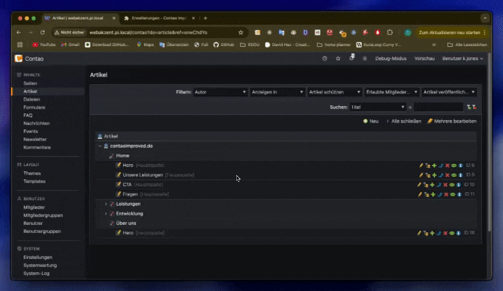
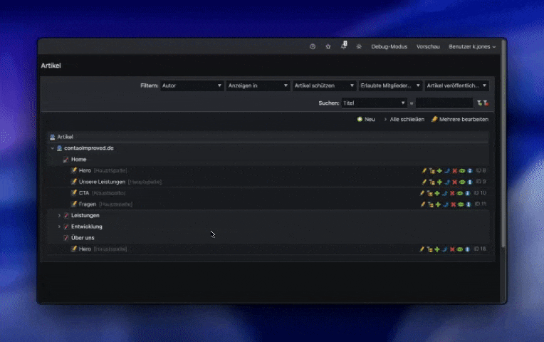

# Contao Improved

**Contao Improved** is a lightweight Chrome extension that enhances the Contao backend with several quality-of-life features for editors and developers.

---

## ✨ Features

- **Context Menu:**  
  Quickly access actions by right-clicking on element entries.

- **Search Bar in Edit Multiple Screen:**  
  Easily find and filter settings when editing multiple elements.

- **Highlight Selected Elements:**  
  Visually highlight elements when selecting multiple entries.

- **Display Element IDs:**  
  Instantly see the IDs of elements in the backend.

---

## 🛠️ Feature Details

### Context Menu

Adds a custom context menu when right-clicking on an element entry, providing quick access to useful actions.

**Options:**  
- Enabled  
- Disabled

---

### Search Bar

Introduces a search bar on the "edit multiple" screen to help you quickly locate settings for any element.

**Options:**  
- **Highlight:** Highlights matching settings as you type.  
- **Filter:** Only displays settings that match your search.  
- **Disabled:** Hides the search bar.

---

### Display IDs

Shows the ID of each element directly in the backend interface for easier reference.

**Options:**  
- Enabled  
- Disabled

---

## 🚀 Getting Started

1. **Install** the extension from the Chrome Web Store (link coming soon).
2. **Open** the Contao backend.
3. **Configure** the extension options to fit your workflow.

---

## 🕰️ Planned

- Multi actions: Perform a action on muliple elements
- More coming soon...

## 💡 Feedback & Contributions

Suggestions, bug reports, and contributions are welcome!  
Feel free to open an issue or submit a pull request.

---

**Enjoy a more productive Contao experience!**